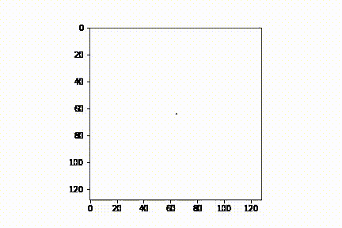
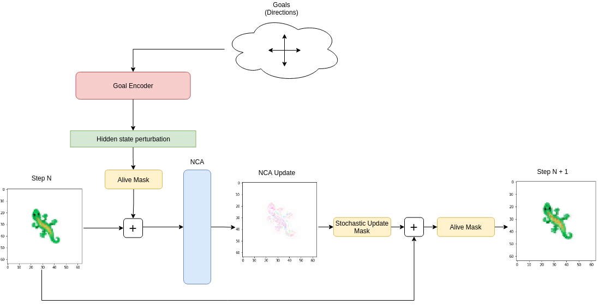
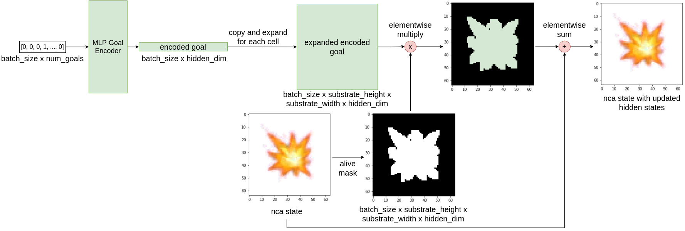
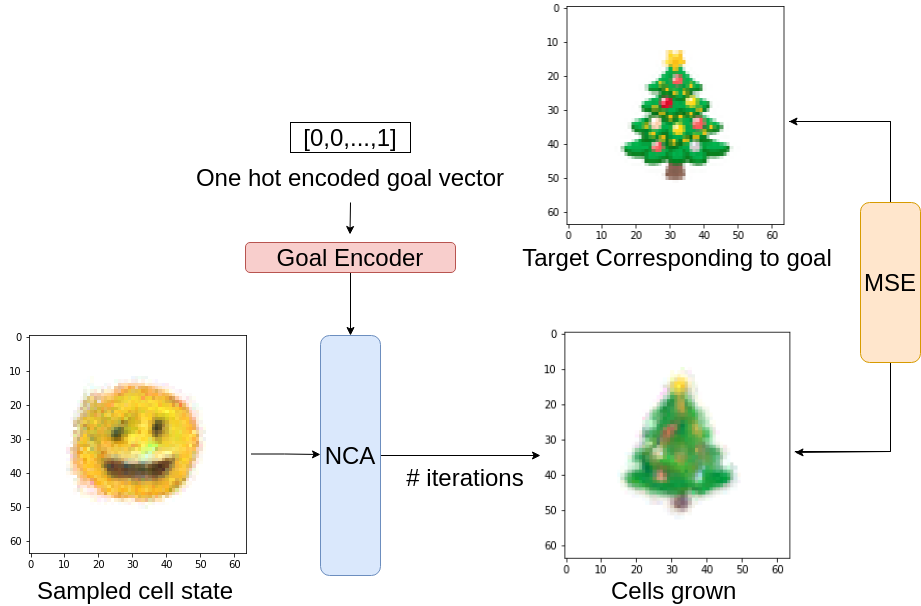

 
---

<div align="center">    
 
# Goal-Guided Neural Cellular Automata: Learning to Control Self-Organising Systems

<!-- [](https://arxiv.org/abs/2204.11674) -->

<p float="left">
  
   
</p>
</div>


### This repository contains code for the experiments detailed in the paper: "Goal-Guided Neural Cellular Automata: Learning to Control Self-Organising Systems", where we introduce GoalNCA, a simple system for controlling NCA cells.

<!-- 
<p align="center">
  
</p> -->
<!--  -->

## Installation

```bash
git clone https://github.com/shyamsn97/controllable-ncas
cd controllable-ncas/
python setup.py install
```

## What's GoalNCA?

GoalNCA, in short, augments the original NCA system (introduced in https://distill.pub/2020/growing-ca/ -- Mordvintsev, et al., "Growing Neural Cellular Automata", Distill, 2020) with a lightweight encoder that is able to dynamically guide cell behaviors towards various goals.

### Single step in the NCA

<div align="center">



</div>


### Goal Encodings
These cells are represented as vectors in a 2D grid, representing rgb values and hidden states that carry information over time. The goal encoder leverages this by perturbing the hidden states to guide the cells towards a particular goal.

<div align="center">



</div>

### How can we train this?
By repeatedly sampling goals and nca states during training, we can train GoalNCA to essentially enable cells to converge from one goal to any other goal.
<div align="center">



</div>


## Experiments

### Morphing Emoji
See [notebooks/MorphingEmoji.ipynb](notebooks/MorphingEmoji.ipynb) for interactive usage, including loading in pretrained models in [saved_models/](saved_models/)

Components can be found [controllable_nca/experiments/morphing_image/](controllable_nca/experiments/morphing_image/)

Actual full code to run this experiment [controllable_nca/experiments/morphing_image/run.py](controllable_nca/experiments/morphing_image/run.py):

```python
from datetime import datetime
from typing import Optional, Tuple  # noqa

import torch
import torch.nn as nn
from torch.nn import Embedding

from controllable_nca.experiments.morphing_image.emoji_dataset import EmojiDataset
from controllable_nca.experiments.morphing_image.trainer import MorphingImageNCATrainer
from controllable_nca.nca import ControllableNCA

class DeepEncoder(nn.Module):
    def __init__(self, num_embeddings: int, out_channels: int):
        super().__init__()
        self.num_embeddings = num_embeddings
        self.embedding = Embedding(num_embeddings, 32)
        self.encoder = nn.Sequential(
            nn.Linear(32, 32),
            nn.ReLU(),
            nn.Linear(32, out_channels, bias=False),
        )

    def forward(self, indices):
        embeddings = self.encoder(self.embedding(indices))
        return embeddings

NUM_HIDDEN_CHANNELS = 16

dataset = EmojiDataset(image_size=64, thumbnail_size=40)

encoder = DeepEncoder(dataset.num_goals(), NUM_HIDDEN_CHANNELS)

nca = ControllableNCA(
    num_goals=dataset.num_goals(),
    use_image_encoder=False,
    encoder=encoder,
    target_shape=dataset.target_size(),
    living_channel_dim=3,
    num_hidden_channels=NUM_HIDDEN_CHANNELS,
    cell_fire_rate=0.5,
)

device = torch.device("cuda")
nca = nca.to(device)
dataset.to(device)

trainer = MorphingImageNCATrainer(
    nca,
    dataset,
    nca_steps=[48, 96],
    lr=1e-3,
    num_damaged=0,
    damage_radius=3,
    device=device,
    pool_size=1024,
)

trainer.train(batch_size=8, epochs=100000)

# save model
nca.save("test.pt")

# load
nca.load("test.pt")

```

### Movable Emoji
See [notebooks/MovableEmoji.ipynb](notebooks/MovableEmoji.ipynb) for interactive usage, including loading in pretrained models in [saved_models/](saved_models/)

Components can be found [controllable_nca/experiments/movable_emoji/](controllable_nca/experiments/movable_emoji/)

Actual full code to run this experiment [controllable_nca/experiments/movable_emoji/run.py](controllable_nca/experiments/movable_emoji/run.py):

```python
from datetime import datetime
from typing import Optional, Tuple  # noqa

import torch

from controllable_nca.experiments.movable_emoji.movable_emoji_dataset import (
    MovableEmojiDataset,
)
from controllable_nca.experiments.movable_emoji.trainer import MovableEmojiNCATrainer
from controllable_nca.nca import ControllableNCA

dataset = MovableEmojiDataset(grid_size=64, image_size=32)

NUM_HIDDEN_CHANNELS = 32

nca = ControllableNCA(
    num_goals=dataset.num_goals(),
    target_shape=dataset.target_size(),
    living_channel_dim=3,
    num_hidden_channels=NUM_HIDDEN_CHANNELS,
    cell_fire_rate=1.0,
)

device = torch.device("cuda")
nca = nca.to(device)
dataset.to(device)

trainer = MovableEmojiNCATrainer(
    nca,
    dataset,
    nca_steps=[48, 64],
    lr=1e-3,
    num_damaged=0,
    damage_radius=3,
    device=device,
    pool_size=256,
)

trainer.train(batch_size=24, epochs=100000)

# save model
nca.save("test.pt")

# load
nca.load("test.pt")

```

## Citation

If you use the code for academic or commecial use, please cite the associated paper:

```bibtex
TO ADD

```